  

# こんにちは、SEMO-diX です

**AI駆動でソフトウェアを開発しながら、LLMの外部記憶を作っています。**

LLM が「覚えています」と言うとき、その記憶は何で確かめられるのか。  
そこを出発点に、会話をまたいで残る外部記憶の仕組みを作っています。

## AI に任せて、自分を拡張する

私は、AI駆動でソフトウェアを開発しています。

設計を詰めるのもコードを書くのも、多くは ChatGPT と Codex に任せています。  
自分の仕事は、**何を作るかを決めること、任せた結果を確かめること、そして任せ方そのものを改善し続けること**です。

> 目的を決める → AI に任せる → 結果を検証する → 任せ方を改善する

任せる量が増えるほど、AI が前の会話を正しく引き継いでいるかが問題になります。  
**LEMP** はそこから生まれました。いまは LEMP の内部版を記憶の土台にして、LEMP 自身を開発しています。

## いま作っているもの

### [LEMP](https://github.com/SEMO-diX/lemp)

ChatGPT の GitHub 連携を使って、会話をまたいで残したい文脈を GitHub リポジトリに置く仕組みです。

ChatGPT の書き込みはまず候補として扱い、GitHub Actions の検証を通ったものだけを正本として読み込みます。  
新しい会話で `memory status` と頼めば、ChatGPT が正本の checkpoint と検証結果を確かめて、状態を報告します。

Python と GitHub Actions で実装しています。ライセンスは Apache-2.0。現在は公開 MVP を開発中です。

### [OllaCode](https://github.com/SEMO-diX/claudecode-ollama-)

Ollama で動く、ローカルの AI コーディングエージェント CLI です。

ファイル編集、コマンド実行、コード検索、Python の仮想環境管理、Web 検索を、ひとつの対話の中で行えます。  
ブラウザ操作が必要なときは Playwright を追加できます。

## 読む・話す

note と X は最近あまり更新できていませんが、書くときはここに書きます。

[note](https://note.com/semo_dix) ・ [X @SEMO_Dix](https://x.com/SEMO_Dix)
